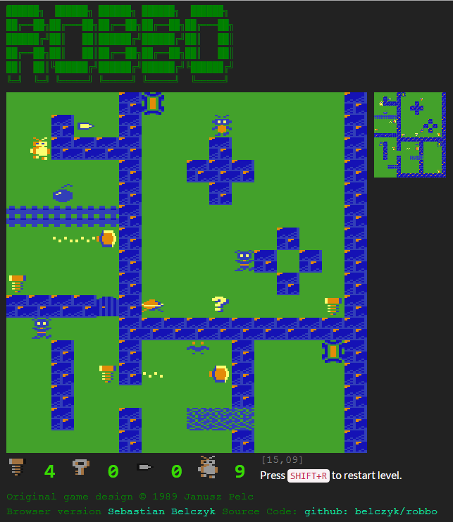
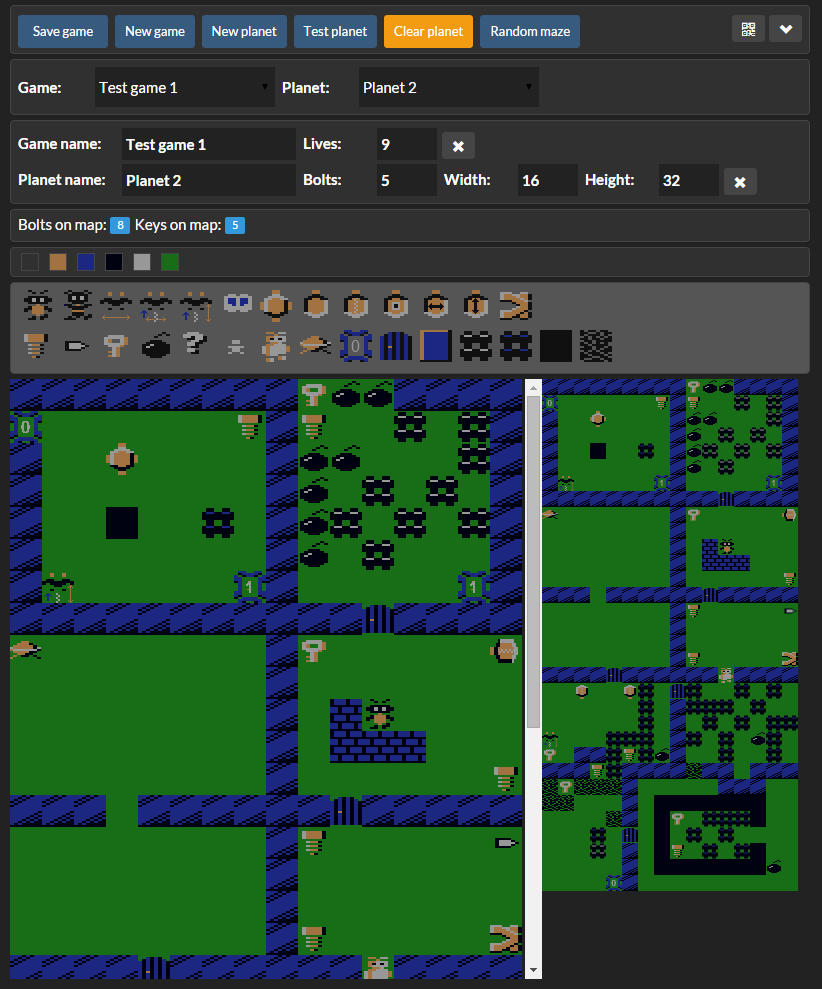

Robbo
=====

Old school Atari games Robbo and Robbo Constructor resurected in a browser with the power of CoffeeScript.
The orginal game was created by [Janusz Pelc](http://pl.wikipedia.org/wiki/Janusz_Pelc_(programista)) for [8-bit Atari](http://en.wikipedia.org/wiki/Atari) computer. Published by [Laboratorium Komputerowe Avalan](http://en.wikipedia.org/wiki/LK_Avalon) in 1989 (Robbo Constructor 1990).

You can play this game here: [robbo.belczyk.com](http://robbo.belczyk.com/)
Task board: [Robbo tasks board on trello](https://trello.com/b/32AXUnia/robbo)

I recreated this game using CoffeScript as a part of my CoffeeScript training. The first version of the game was simply an excercise and demo presenting power of CoffeeScript class system. Once I discovered how much fun I get building it I've continued work on the game as my pet project.

Main things I'am exploring:
* Mixins (most of the generic behaviours like "it can be moved", "it can be collected", "it kills you" are mixins so I can create new objects quite fast).
* JavaScript tests. `unit_tests.html` runs all test writen for this game.
* Messaging in JavaScript (more like in UI all tougether). 
* Bits of HTML5 (for example for playing sounds).

Game is designed as stand alone HTML page. It means you can just checkout this repository and open `game/robbo.html` and play my last definition of levels. 

Levels and games are stored in `game/config/universe.js`. You can use Robbo Constructor to edit games and planets.

Robbo Constructor
=====
Robbo Constructor allows to build games and planets for robbo. 
As it's also stand alone HTML page. Games and planets are sotred in file (`game/config/universe.js`) there is a need for server which will save file on page request. For that reason thre is `game/Robbo Constructor Server.exe`. When you run this program it will open `robbo_constructor.htm` and also console application which is a self-hosted WebAPI. 

